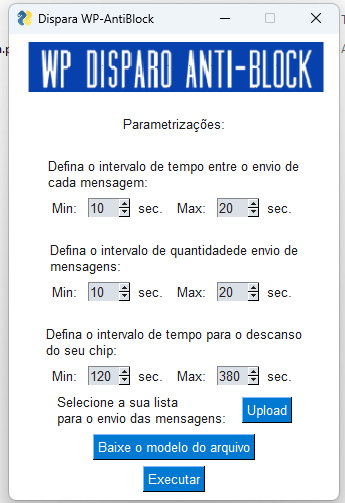

# WP-Disparo-Anti Block
## Um Protótipo funcional, criado com Python e a interface PySimpleGui

### Links Externos:

Para vê-lo em ação: [ acesse esse link](https://www.youtube.com/watch?v=hDFCty_WvVQ).

#### Projeto desenvolvido a partir do código disponibilizado pelo Lira do canal Hahstag programção desse vídeo: [ acesse esse link](https://www.youtube.com/watch?v=wrxrpC5Yeac).
